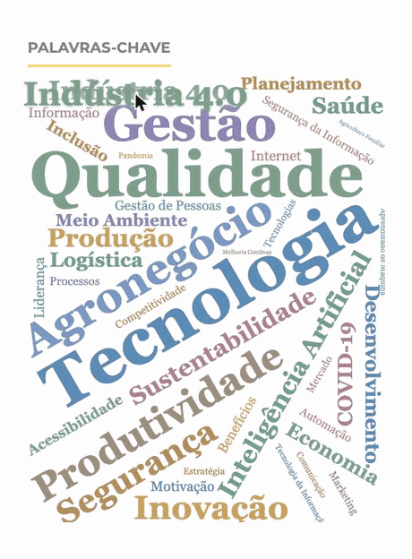

# Keyword Cloud (Classic · Beautiful) — OJS plugin

**⬇️ Install package:** [OJS 3.5](https://github.com/OJSBR/keywordCloudClassicBeautiful/releases/download/1.0.2.0/keywordCloudClassicBeautiful-1.0.2.0.tar.gz) · [OJS 3.4](https://github.com/OJSBR/keywordCloudClassicBeautiful/releases/download/1.0.0.1-ojs3.4/keywordCloudClassicBeautiful-1.0.0.1-ojs3.4.tar.gz) — or browse all [Releases](../../releases).

A **block plugin** for **Open Journal Systems (OJS)** that renders a **real, packed keyword
cloud** in the sidebar — where each keyword is **sized and coloured by how often it is used**
across the journal's published articles. It restores the **classic behaviour** (the most-used
keywords stand out), which was lost in later versions, and renders it **entirely from a
bundled library — no external CDN**, so it can never break from a remote library change.

> **Based on the original `keywordCloud` block plugin** — part of the **Public Knowledge
> Project (PKP)**, © **Simon Fraser University** and © **John Willinsky**, and maintained in
> recent years by **[Lepidus Tecnologia](https://lepidus.com.br)** — and on the
> **[wordcloud2.js](https://github.com/timdream/wordcloud2.js)** layout engine by **Tim
> Guan-tin Chien and contributors** (MIT). Reimplemented for OJS 3.4/3.5 and maintained by
> **[OJSBR](https://ojsbr.com)** — full details in the
> [Credits & acknowledgements](#credits--acknowledgements) section.

Recorded on [Revista Interface Tecnológica](https://revista.fatectq.edu.br/interfacetecnologica) (FATEC Taquaritinga), with its real keywords.

## Compatibility & branches

| OJS version | Branch | Plugin release |
|-------------|--------|----------------|
| OJS 3.5.x   | [`stable-3_5_0`](../../tree/stable-3_5_0) *(default)* | 1.0.2.0 |
| OJS 3.4.x   | [`stable-3_4_0`](../../tree/stable-3_4_0) | 1.0.0.1-ojs3.4 |

## What it does

- **Frequency sizing (the classic behaviour)** — the more articles use a keyword, the larger
  it appears. Sizes are mapped with a square-root scale so the mid-range stays readable
  instead of a couple of giants drowning everything else.
- **A real packed cloud** — words are laid out packed together at **varied positions and
  rotations** (horizontal, vertical and **diagonal**), not a flat list.
- **Colourful** — a tasteful multi-colour palette (size carries the frequency, colour adds
  variety). Three palettes to choose from.
- **Hover emphasis** — hovering a keyword gently highlights it **in place, at its own angle**,
  and it is **clickable** — each keyword links to the journal search for that term.
- **Configurable** — block size, an explicit **vertical height**, rotation mode, colour
  palette, font family, number of keywords, smallest/largest font size, and a sample-when-empty
  toggle. All from the plugin settings modal.
- **Sample when empty** — on a journal with no published keywords yet, it shows a representative
  sample cloud (clearly labelled) so the sidebar still looks right.
- **Self-contained & robust** — the layout library is **vendored inside the plugin**; nothing is
  fetched from a CDN at run time. No core patching.
- **Accessible & SEO-friendly** — degrades to a real `<ul>` of keyword links when JavaScript is
  off (that same list is the data source for the canvas).
- **Multilingual** — ships in **7 languages**: English, Portuguese (Brazil), **Portuguese
  (Portugal)**, Spanish, French, Italian and German.

## Configuration

Enable the plugin, then place it in **Settings → Website → Appearance → Sidebar**. Its options
(gear icon on the Plugins list) are:

| Setting | What it controls |
|---------|------------------|
| **Block size** | Overall size (small / medium / large), as a proportion of the sidebar width. |
| **Block height (px)** | Explicit vertical height; `0` = automatic (from block size). |
| **Rotation** | Horizontal only · horizontal + vertical · **varied (with diagonals)**. |
| **Colour palette** | Soft · vibrant · monochrome (blue). |
| **Font** | Serif · sans-serif · rounded. |
| **Number of keywords** | How many of the most-used keywords to show. |
| **Smallest / largest font size** | The px range mapped from least- to most-frequent. |
| **Sample when empty** | Show a sample cloud when the journal has no keywords yet. |

## How it works (technical)

- It reads the **submission keywords** (`controlledVocab` of type `submissionKeyword`) of every
  **published** publication in the journal, per locale, and counts how many publications use
  each keyword.
- Font size, weight, colour and opacity are computed **server-side** in PHP; the cloud is packed
  **client-side** on a `<canvas>` using a bundled copy of **wordcloud2.js**.
- To let the hover highlight sit **at each word's real angle**, the bundled library carries a
  tiny, documented patch that exposes the per-word rotation to the `hover()` callback
  (marked `/* OJSBR patch */`).
- Results are cached for two days (`Cache::remember`).

## Credits & acknowledgements

This plugin stands on the shoulders of earlier work, and we thank the developers who came before:

- **The original `keywordCloud` block plugin for OJS** — part of the **Public Knowledge Project
  (PKP)** ecosystem, © **Simon Fraser University** and © **John Willinsky**, and maintained in
  recent years by **[Lepidus Tecnologia](https://lepidus.com.br)**. Their plugin established the
  idea, the keyword-aggregation approach and the OJS integration. This edition reimplements it
  for OJS 3.5 and **restores the classic frequency-based sizing**.
- **[wordcloud2.js](https://github.com/timdream/wordcloud2.js)** — the word-cloud layout engine,
  © **Tim Guan-tin Chien and contributors**, released under the **MIT license**. It is bundled in
  `js/wordcloud2.js` (with a small documented patch) and is **not** fetched from any CDN.
- **The Public Knowledge Project (PKP)** — for OJS, its controlled-vocabulary/keyword data model
  and the plugin framework this builds on.
- **This OJSBR edition** — the OJS 3.5 reimplementation, the restored frequency sizing, the
  self-contained rendering, the in-place hover highlight, the settings panel and the
  multilingual packaging — developed and maintained by **[OJSBR](https://ojsbr.com)**.

**Third-party licenses:** `js/wordcloud2.js` is distributed under the MIT license (see the header
of that file). All other files in this repository are distributed under the **GNU GPL v3**.

## Contributing

Issues and pull requests are welcome. Please read [CONTRIBUTING.md](CONTRIBUTING.md) and our
[Code of Conduct](CODE_OF_CONDUCT.md).

## License

Distributed under the **GNU General Public License v3.0**. See [LICENSE](LICENSE) and
[docs/COPYING](docs/COPYING). Bundled third-party code keeps its own license (see above).

---

## 🇧🇷 Português

Um **plugin de bloco** para o **Open Journal Systems (OJS)** que desenha uma **nuvem de
palavras-chave de verdade** na barra lateral — cada palavra com **tamanho e cor conforme a
frequência de uso** nos artigos publicados da revista. Ele **restaura o comportamento clássico**
(as palavras mais usadas se destacam), perdido em versões posteriores, e renderiza tudo a partir
de uma **biblioteca embarcada — sem CDN externo**, então nunca quebra por causa de uma biblioteca
remota.

> **Baseado no plugin de bloco `keywordCloud` original** — parte do **Public Knowledge
> Project (PKP)**, © **Simon Fraser University** e © **John Willinsky**, mantido nos últimos
> anos pela **[Lepidus Tecnologia](https://lepidus.com.br)** — e no motor de layout
> **[wordcloud2.js](https://github.com/timdream/wordcloud2.js)** de **Tim Guan-tin Chien e
> colaboradores** (MIT). Reimplementado para o OJS 3.4/3.5 e mantido pela
> **[OJSBR](https://ojsbr.com)** — detalhes completos na seção
> [Créditos e agradecimentos](#créditos-e-agradecimentos).

### Compatibilidade e branches

| Versão do OJS | Branch | Release |
|---------------|--------|---------|
| OJS 3.5.x     | [`stable-3_5_0`](../../tree/stable-3_5_0) *(padrão)* | 1.0.2.0 |
| OJS 3.4.x     | [`stable-3_4_0`](../../tree/stable-3_4_0) | 1.0.0.1-ojs3.4 |

### O que faz

- **Tamanho por frequência (o comportamento clássico)** — quanto mais artigos usam uma
  palavra-chave, maior ela aparece. Escala de raiz quadrada para o meio-termo ficar legível.
- **Nuvem empacotada de verdade** — palavras encaixadas em **posições e rotações variadas**
  (horizontal, vertical e **diagonal**), não uma lista.
- **Colorida** — paleta multicor (o tamanho carrega a frequência, a cor dá variedade); três
  paletas à escolha.
- **Destaque no hover** — ao passar o mouse, a palavra ganha um leve realce **no lugar e no seu
  próprio ângulo**, e é **clicável** — leva à busca da revista por aquele termo.
- **Configurável** — tamanho do bloco, **altura vertical** explícita, modo de rotação, paleta,
  fonte, número de palavras, tamanhos mínimo/máximo de fonte e o modo de amostra.
- **Amostra quando vazio** — numa revista ainda sem palavras-chave, mostra uma nuvem de exemplo
  (identificada) para a barra lateral não ficar vazia.
- **Autocontido e robusto** — a biblioteca de layout fica **embarcada no plugin**; nada é buscado
  de CDN em tempo de execução. Sem alterar o núcleo do OJS.
- **Acessível e amigável a SEO** — degrada para uma `<ul>` real de links quando o JavaScript está
  desligado (essa mesma lista é a fonte de dados do canvas).
- **Multilíngue** — em **7 idiomas**: inglês, português (Brasil), **português (Portugal)**,
  espanhol, francês, italiano e alemão.

### Instalação

Baixe o `.tar.gz` acima e envie em **Configurações → Site → Plugins → Enviar novo plugin**;
depois posicione o bloco em **Configurações → Site → Aparência → Barra lateral**.

### Créditos e agradecimentos

Este plugin se apoia em trabalho anterior, e agradecemos a quem veio antes:

- **O plugin de bloco `keywordCloud` original do OJS** — parte do ecossistema do **Public
  Knowledge Project (PKP)**, © **Simon Fraser University** e © **John Willinsky**, mantido nos
  últimos anos pela **[Lepidus Tecnologia](https://lepidus.com.br)**. O plugin deles estabeleceu a
  ideia, a agregação de palavras-chave e a integração com o OJS. Esta edição o reimplementa para o
  OJS 3.5 e **restaura o dimensionamento clássico por frequência**.
- **[wordcloud2.js](https://github.com/timdream/wordcloud2.js)** — o motor de layout da nuvem, ©
  **Tim Guan-tin Chien e colaboradores**, sob licença **MIT**. Vem embarcado em `js/wordcloud2.js`
  (com um pequeno patch documentado) e **não** é buscado de nenhum CDN.
- **O Public Knowledge Project (PKP)** — pelo OJS, seu modelo de vocabulário controlado /
  palavras-chave e o framework de plugins.
- **Esta edição OJSBR** — a reimplementação para 3.5, o dimensionamento restaurado, a renderização
  autocontida, o destaque no hover, o painel de configurações e o empacotamento multilíngue —
  desenvolvida e mantida pela **[OJSBR](https://ojsbr.com)**.

**Licenças de terceiros:** `js/wordcloud2.js` é distribuído sob a licença MIT (veja o cabeçalho do
arquivo). Todos os demais arquivos deste repositório são distribuídos sob a **GNU GPL v3**.

### Licença

Distribuído sob a **GNU General Public License v3.0**. Veja [LICENSE](LICENSE) e
[docs/COPYING](docs/COPYING). Código de terceiros embarcado mantém sua própria licença (acima).
